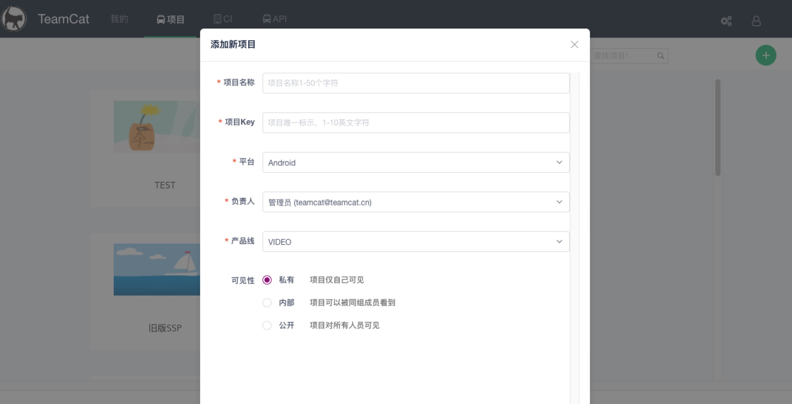
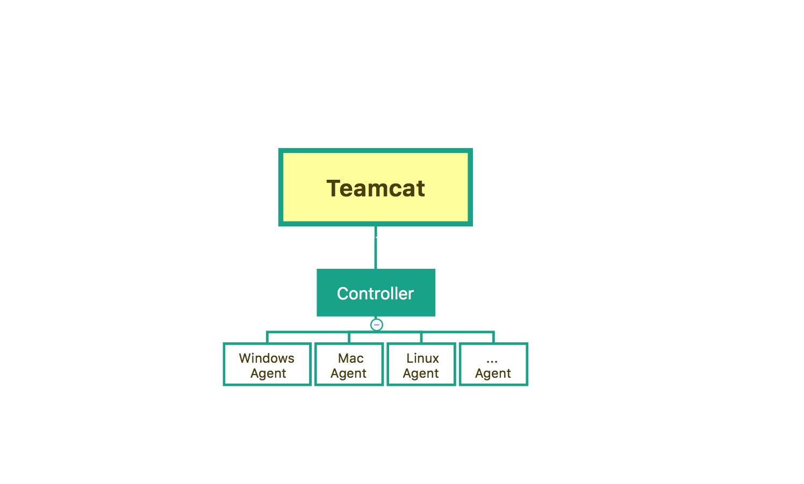

# TeamCat: 高效的软件项目管理，协作工具

Teamcat的项目管理包含了任务、提测、Bug管理，统计分析等功能。支持多成员协作，并且深度集成了持续集成（CI）。Teamcat 支持每日构建，自动化测试，一键部署等功能。 Teamcat 通过任务流功能支持流水线构建发布，正真做到高效的软件过程管理与监控。
Demo展示地址：[www.teamcat.cn](http://www.teamcat.cn)


## Installation

TeamCat安装部署部分在distribute文件夹中，分为docker一键部署与shell一键部署两种方式：

### docker一键部署

前提：需要目标机器安装docker环境，并且系统要求在docker_V1.8,CentOS_7以上
1. 将distribute文件夹拷贝到要部署的目标机器
2. 进入到distribute/0.0.1/one_step_build_docker/文件夹中,执行如下命令：
 
   ```sh
   $ docker-compose build
   $ docker-compose up
   ```

### shell一键部署

1. 将distribute文件夹拷贝到要部署的目标机器
2. 进入到distribute/0.0.1/one_step_build_shell/文件夹中,切换到root权限
3. 执行one_step_setup.sh

   ```sh
   $ ./one_step_setup.sh
   ```
   修改distribute/0.0.1/one_step_build_shell/teamcat/doraemon/settings.py文件，将debug置为true,ALLOWED_HOSTS按原有结构将本机Ip添加 到里面。
   执行teamcat.sh
   
   ```sh
   $ ./teamcat.sh
   ```
4. 若目标机器已安装mysql，在进行到是否安装mysql时，请点击N，并进入到mysql文件夹执行如下命令（${password}为已有mysql的密码）

   ```sh
   mysql -uroot -p${password}  < doraemon_nirvana.sql
   mysql -uroot -p${password}  < privileges.sql
   ```
   若目标机器无mysql环境，点击Y，在安装完成后执行如下命令：
   获取生成的随机密码：
   ```sh
   $ grep 'temporary password' /var/log/mysqld.log |awk '{print $NF}'
   ```
   用获取到的随机密码替换下面${mysqlpassword}执行命令：
   ```sh
   $ mysql -uroot -p${mysqlpassword}  -e "set global validate_password_policy=0"

   $ mysql -uroot -p${mysqlpassword}  -e "set global validate_password_length=6"

   $ mysql -uroot -p${mysqlpassword}  -e "ALTER USER 'root'@'localhost' IDENTIFIED BYY '123456'"
   ```
   进入到mysql文件夹执行ImportSQL.sh脚本
   ```sh
   $ ./ImportSQL.sh

   ```
   之后进入到teamcat文件夹，执行kill_uwsgi.py文件杀掉已有进程，执行teamcat.sh文件重启teamcat服务
    ```sh
   $ ./teamcat.sh

   ```

## Quick Start

   安装成功后，输入目标机器地址，端口8848，例如http://127.0.0.1:8848/ 访问teamcat
### 项目
1. 添加首个自己的项目

2. 进入到项目就可以使用问题，提测，任务，统计，归档等功能。
### CI:
   CI部分功能使用需要部署Controller与Agent，Controller具有监听、调度、下发任务等功能，Agent负责在所需的不同机器上执行具体构建任务，简要架构如下：

1. 部署步骤：
   将distribute/0.0.1/目录下将agent与conroller的zip包拷贝到目标机器，修改properties文件，将url配置为已成功部署teamcat的url地址。Linux，Mac机器运行.sh文件启动，windows机器运行.bat文件启动。
2. 使用步骤：
   首先进入CI-设置，添加一个Agent。添加一个CI任务，设置好任务配置及构建参数即可实现每日构建，自动化测试，一键部署等功能。并且支持任务流创建，通过任务流功能支持流水线构建发布。

## Q&A
### Question:
如果我想部署的目标机器已经存在mongo,redis,nginx,mysql等基础组件，不想重新安装这些可以直接启动TeamCat服务吗？

### Answer:
当然可以啦，但是首先目标机器需要创建/web/www/目录，并将distribute文件夹下的teamcat文件夹拷贝到此目录，打开teamcat/doraemon/settings.py文件，将其中的ALLOWED_HOSTS，MYSQLHOST，MONGOHOST，REDIS_HOST分别配置成已有环境的地址，并且EMAILCONFIG中的邮件服务器必须具有发邮件的权限才能正常发送构建通知邮件。如果不想创建此目录，需将settings.py文件中所有配置为/web/www/目录的地方改成teamcat实际所在目录的地址。

## More

如果大家有更多的问题或改进想法，欢迎访问我们的demo地址[www.teamcat.cn](http://www.teamcat.cn)，通过里面的联系方式与我们多多沟通交流。

